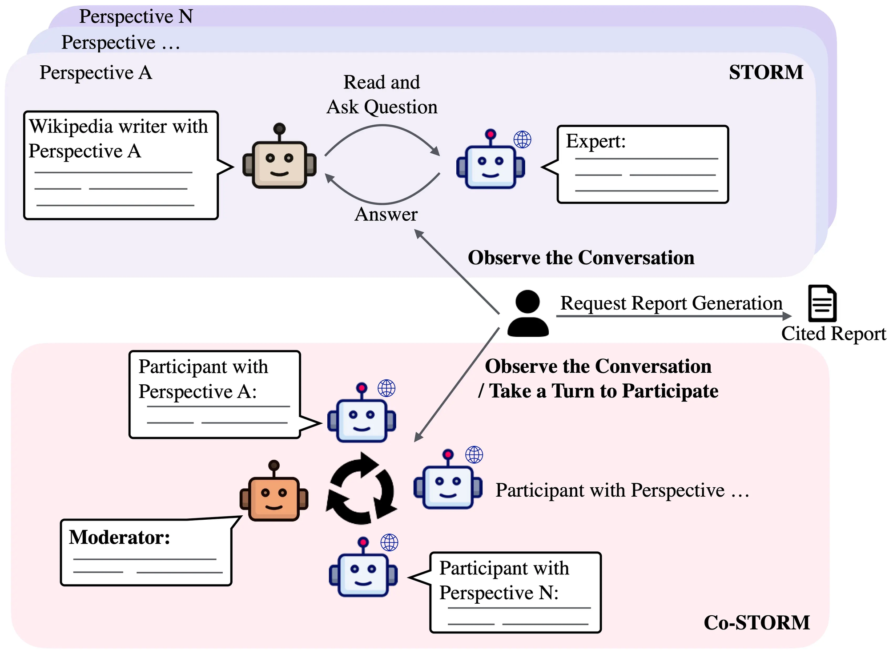

<h1 align="center">STORM for Claude Code</h1>

<p align="center">
  <em>Type one command. Get a cited, multi-perspective research report.</em>
</p>

<p align="center">
  
</p>

<p align="center">
  <sub>Architecture figure from the Stanford OVAL STORM project. This plugin reproduces the top (STORM) loop as a Claude Code prompt pipeline.</sub>
</p>

<p align="center">
  <a href="https://github.com/hadufer/claude-storm/releases"></a>
  <a href="https://github.com/hadufer/claude-storm/stargazers"></a>
  <a href="LICENSE"></a>
  <a href="https://storm.genie.stanford.edu/"></a>
</p>

Stanford built a research system called STORM. It writes Wikipedia-style, cited articles by interviewing a topic from several perspectives. You can try the official version at [storm.genie.stanford.edu](https://storm.genie.stanford.edu/).

This plugin runs the same idea inside Claude Code. One command, no GitHub clone, no API keys. It discovers perspectives, interviews each one against real web sources, maps where they disagree, writes a cited report, and grades its own work.

## Before and after

Without it, you ask once and get the majority view with no sources. Or you paste four separate prompts and keep track of the thread yourself.

With it, you type one command and get a sourced, multi-perspective report saved to a file:

```bash
/storm:storm the impact of generative AI on education
```

## How it works

`/storm:storm` runs the STORM pipeline step by step.

1. Perspective discovery. Five lenses (practitioner, academic, skeptic, economist, historian) plus STORM's "basic fact writer", adapted to the topic.
2. Grounded interviews in parallel. One `storm-researcher` subagent per perspective runs a writer-and-expert interview over three rounds, backed by real web search. Every claim is cited.
3. Contradiction map. Where the perspectives clash, what they all agree on (so probably true), and the blind spot none of them covered.
4. Outline. Drafted first, then refined with what the interviews found.
5. Cited article. Written section by section (`storm-writer` subagents in parallel), with `[n]` citations globalized and de-duplicated by URL.
6. Synthesis briefing. A 60-second summary for a decision maker, five findings ranked by reliability, a non-obvious connection, a concrete action, and the open question that would change the picture.
7. Self peer-review. Confidence scores from 1 to 10, the weakest claim, a bias check, a missing perspective, and a final grade. This is the fix for STORM's known weakness: the system does not critique itself.

The report is saved to `storm-<topic>.md` with a clickable References section.

## Commands

| Command | Web | Subagents | Output |
|---------|:---:|:---------:|--------|
| `/storm:storm` | yes | yes, in parallel | Full cited report, briefing and peer-review, saved to disk |
| `/storm:storm-brief` | no | no | Fast four-phase briefing, not sourced, shown in chat |

`/storm:storm-brief` runs Nav Toor's four-prompt method in a single pass with no web calls. Use it when you want the five-minute briefing without waiting on research.

## Install

### Claude Code, from GitHub

```bash
/plugin marketplace add hadufer/claude-storm
/plugin install storm@storm-marketplace
/reload-plugins
```

### Claude Code, from a local folder

```bash
/plugin marketplace add /path/to/claude-storm
/plugin install storm@storm-marketplace
/reload-plugins
```

### Try it for one session, without installing

```bash
claude --plugin-dir /path/to/claude-storm
```

Validate the plugin before publishing:

```bash
claude plugin validate .
```

## Usage

```bash
# Full grounded, cited research
/storm:storm the impact of generative AI on education

# Optional flags
/storm:storm electric vehicles --depth deep --lang en
/storm:storm quantum computing --depth quick

# Fast one-pass briefing, no web
/storm:storm-brief SaaS pricing strategy --role founder
```

### Flags

- `--depth quick | standard | deep`: research depth. Default is `standard`, meaning five perspectives plus the basic writer and three interview rounds.
- `--lang <code>`: language of the deliverable. Default is the language of your query.
- `--no-web`: skip web search. Avoid this; use `storm-brief` instead.
- `--role <role>` (brief mode): your role, used to tailor the concrete action.

Plugin commands always carry the plugin prefix, here `storm`. That is why you type `/storm:storm` and `/storm:storm-brief`.

## Cost and performance

`/storm:storm` is heavy on purpose. It runs several subagents and many web searches to reach a quality that takes a person 40 to 60 hours by hand. For an answer in seconds with no web calls, use `/storm:storm-brief`.

Run the full command on Opus for synthesis quality. The `storm-researcher` subagents default to Sonnet for speed and parallelism. STORM does the same: a light model for the conversations, a stronger one for the writing.

## Plugin structure

```
claude-storm/
├── .claude-plugin/
│   ├── plugin.json          # manifest (name: "storm")
│   └── marketplace.json     # distribution catalog
├── skills/
│   ├── storm/
│   │   ├── SKILL.md         # /storm:storm, the full orchestrator
│   │   └── reference.md     # STORM prompts, conventions, report template
│   └── storm-brief/
│       └── SKILL.md         # /storm:storm-brief, the four-prompt method
├── agents/
│   ├── storm-researcher.md  # grounded, perspective-guided interviewer
│   └── storm-writer.md      # cited section writer
├── assets/
│   └── storm-architecture.png
├── README.md
└── LICENSE
```

## FAQ

**Do I need the STORM repo or any API keys?**
No. It runs entirely inside Claude Code, using the built-in web search and subagents.

**How is this different from the official STORM?**
The official tool runs as Python with its own retrieval backends. This plugin reproduces the method as a prompt pipeline so it works from one Claude Code command. For the original, see [storm.genie.stanford.edu](https://storm.genie.stanford.edu/) and [stanford-oval/storm](https://github.com/stanford-oval/storm).

**Is it affiliated with Stanford?**
No. This is an independent project. The method and the architecture figure are credited to the Stanford OVAL Lab.

**Why are the commands prefixed with `storm:`?**
Claude Code namespaces every plugin command by the plugin name.

## Credits

STORM is by Shao et al., "Assisting in Writing Wikipedia-like Articles From Scratch with Large Language Models", NAACL 2024 ([arXiv:2402.14207](https://arxiv.org/abs/2402.14207)). Code: [stanford-oval/storm](https://github.com/stanford-oval/storm) (MIT). Official live demo: [storm.genie.stanford.edu](https://storm.genie.stanford.edu/).

The four-prompt adaptation is by Nav Toor ([@heynavtoor](https://x.com/heynavtoor/status/2067194761446920264)).

Independent project, not affiliated with Stanford University. MIT License.
